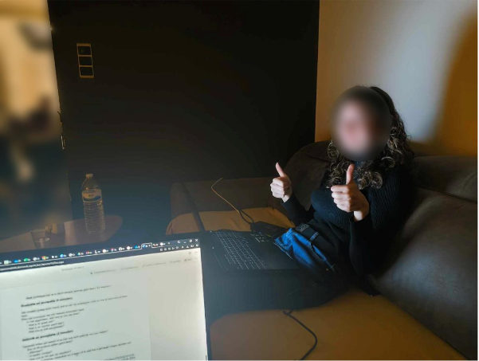
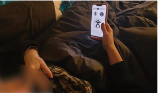

# Remmie
*Een klein apparaatje dat gebruikers zal ondersteunen bij het leren beheersen en hebben van paniekaanvallen.* 

*Projectteam: Sid De Munck, Mattiz Vermeulen, Diego Vande Vyvere*

*2024-2025*

## Samenvatting
De samenleving wordt steeds veeleisender, en dit heeft een directe impact op de mentale gezondheid. Vooral gezien het feit dat psychologen lange wachtlijsten hebben en in sommige gebieden een aanmeldingsstop is, lijkt er een probleem te zijn. 
Door het afnemen van interviews en het uitvoeren van een benchmarking onderzoek, kon er besloten worden dat dit steeds toenemende aantal mensen met paniekaanvallen als een maatschappelijk probleem kan worden beschouwd. 

Een oplossing die mensen met paniekaanvallen kan ondersteunen bestaat uit een klein apparaatje dat als luidspreker zal functioneren en een hierbij horende app. Er wordt gebruik gemaakt van visuele, auditieve en tactiele signalen om de gebruiker doorheen de paniekaanval te leiden tot deze weer is gekalmeerd. 

Dit apparaat biedt ook diverse mogelijkheden om paniekaanvallen te leren beheersen, ongeacht de locatie of het tijdstip, met een groot aanbod aan functies. En dit allemaal op een zeer discrete, toegankelijke manier die altijd beschikbaar is. 

## Introductie
Het aantal mensen dat terecht komt in de psychologische zorg stijgt, dit komt door het groeiende bewustzijn rond mentale gezondheid, minder stigma en een steeds meer toenemende stress in de samenleving. Deze stijging leidt tot een verhoging van de druk binnen de zorgsector. Dit is duidelijk op te merken aan de lange wachtlijsten om bij psychologen binnen te geraken, die soms zelfs gepaard gaan met een aanmeldingsstop [^1]. 

Het doel van dit onderzoek is een product te ontwikkelen dat beter aansluit bij de behoeften van de gebruikers en gebruiker kan helpen bij het zelfstandig verhelpen van paniekaanvallen. Op deze manier is er minder regelmatig een bezoek aan een psycholoog nodig waardoor dit op termijn voorzichtig kan bijdragen aan het verkorten van de wachtlijsten. 

Maar liefst twaalf procent van de Vlaamse bevolking kampt met angststoornissen, waarvan de paniekstoornis deel uit maakt. Met dit project ligt de focus dus op het ontwikkelen van een product dat mensen met paniekaanvallen beter kan ondersteunen waardoor ze er op een zelfstandige manier beter met kunnen leren omgaan. 

Ondanks dat er al veel verschillende bestaande hulpmiddelen op de markt zijn, voldoen ze vaak niet specifiek aan de behoeften van de gebruiker. Ook bestaan er nog geen hulpmiddelen die paniekaanvallen van aan de bron aanpakken, dit met een techniek die tijdens de behandelingssessie van klinische psychologen gebruikt wordt. 
Dankzij de app die bij het product hoort, kan de gebruiker het toestel meer personaliseren naar zijn/haar noden en uitzoeken wat de meest effectieve methode is om met paniekaanvallen om te gaan. 

De doelstelling is om een product te ontwikkelen dat gebruikers overal subtiel kunnen gebruiken. Het product moet in minder dan tien seconden kunnen worden opgestart en de gebruiker moet in minder dan vijf seconden zich een weg kunnen banen doorheen de user interface van de app.  

## Methodologie
Bij de start van het eerste semester werd er individueel aan een concept gewerkt. In deze fase werd er vanuit een divergerend perspectief nagedacht. Hierbij werd er uitgebreid onderzoek gedaan naar het gekozen onderwerp. Er werd een benchmarking onderzoek uitgevoerd en er werden interviews opgesteld en afgenomen (n=3). Deze interviews leverden een aantal belangrijke inzichten die zeker meespeelden bij het ontwikkelen van een eerste concept. Al deze informatie werd gebundeld in een rapport waarna uit deze bekomen info de belangrijkste aspecten konden worden bepaald. Dit werd gedaan aan de hand van een WWWWWH en een persona. 
Op 31/11/2024 werd dit concept gepitched en werden de teams samengesteld.

De eerste fase binnen het team bestond voornamelijk uit het samenleggen van reeds verzamelde inzichten en ideeën en meerdere brainstormsessies. Hieruit ontstond stap voor stap een eerste versie van een storyboard en enkele quick and dirty prototypes. Deze werden verder uitgewerkt en vormden later de basis van de prototypes die gebruikt werden in wave 1 van de gebruikerstesten (n=7). In wave 2 (n=7) werd er gekeken of een bijhorende app een essentieel element zou zijn binnen de ontwikkeling van het product.
Naast deze twee waves werd er nog een literatuuronderzoek uitgevoerd over 'interoceptieve exposure', een methode die door klinische psychologen gebruikt wordt bij het behandelen van paniekvallen.

Op basis van de verkregen informatie uit deze gebruikerstesten werd een meer verfijnd concept ontwikkeld dat we als team in januari tijdens de examens zullen pitchen voor een jury.

 

## Discovery
### Doelstellingen
In dit project wordt er gestreefd naar een product dat helpt bij het verlagen van de druk op de psychologische sector. Met de hedendaagse producten is dit momenteel nog niet mogelijk waardoor er dus wordt gezocht naar een product dat hier wel aan kan bijdragen. De doelstellingen binnen deze discovery fase zijn: achterhalen wie de gebruiker is en wat de noden en behoeften van deze gebruiker zijn. 
Wij formuleerden de opdracht uiteindelijk als: "Hoe kunnen we op een betere manier mensen die last hebben van een paniekstoornis ondersteunen met behulp van zelfhulp(tools) aan de hand van technologie?"

### Materiaal en methoden
Na het bepalen van een doelgroep werd er doormiddel van deskresearch en gebruikersinterviews inzicht verkregen in het probleem. 

Uit de Public Health Monitor 2023 kwamen een aantal zeer schokkende cijfers naar boven. Maar liefst 22% van de Vlaamse bevolking kampt met psychische stoornissen, waarvan 12% met angststoornissen [^2]. Een paniekstoornis is een onderdeel binnen de angststoornissen. 
Naast online naar cijfers zoeken werd er ook een benchmarking onderzoek (n=10) uitgevoerd naar de reeds bestaande hulpmiddelen voor paniekaanvallen. Dit was belangrijk om een beter inzicht te krijgen in welke methoden door de mens als goed werden gezien en welke juist absoluut niet.
Hierbij werd gekeken naar wat het product net zo goed of slecht maakt en wat de speciale eigenschappen van het product zijn. Uit deze reeds bestaande producten kunnen we eventueel enkele elementen laten terug komen in ons eigen product. 

Ook werden er drie gebruikersinterviews afgelegd. Hiervan zijn het protocol, rapport en informed consent terug te vinden in de bijlagen. 
Om het interview op te stellen werd er gestart vanuit de onderzoeksvraag: “Hoe kunnen technologie-gebaseerde zelfhulpmiddelen effectief worden ingezet om mensen met paniekaanvallen beter te ondersteunen en tegelijkertijd de druk op de wachtlijsten voor psychologische hulp te verminderen?”. Ook werd er dieper ingegaan op de vragen: “Wat zijn de belangrijkste voorwaarden waaraan het product moet voldoen?” en “Welke oplossingen bestaan er nu al? En wat is er goed/slecht aan?”.

Uit de verzamelde inzichten konden de steeds herhalende antwoorden worden geclusterd, deze vormen dan ook de basis van het product. In de tabel zijn verschillende functies geordend op hoe belangrijk ze worden gezien door de gebruiker. De meest belangrijke elementen zijn dus discretie, compactheid en gebruiksgemak.

### Resultaten
Met de verkregen informatie uit de interviews kon er een rapport, een persona en een WWWWWH model worden opgesteld. 
Een paar zeer opvallende en veel voorkomende wensen die in de interviews aan bod kwamen zijn:
-	Nood aan emotionele geruststelling van een (vertrouwde) persoon
-	Toegankelijk en makkelijk te gebruiken
-	Discreet in gebruik
-	Manier om het apparaat te personaliseren naar eigen wensen

Al snel werd het idee verkregen om een klein apparaatje te produceren dat als luidspreker zou dienen, met eventueel hierbij horend een app. 

### Conclusies en implicaties
Uit het vooronderzoek is het duidelijk geworden aan welke aspecten het apparaat moet voldoen. Het meest belangrijke aspect is dat het toestel de gebruiker tot rust moet kunnen brengen bij paniek. Naast deze functie is een trainingsfunctie bij het toestel ook zeer belangrijk om op deze manier de druk op de psychologische sector effectief te verlagen. Dit vormt een soort cyclisch proces, wanneer er tijdens de training nood is aan een hulpmiddel om te kalmeren, kan dit meteen gebruikt worden. 
Het is dus duidelijk dat er een nood is aan een variatie van functies. Daarnaast is het ook belangrijk dat de gebruiker snel kan overschakkelen tussen de aangeboden functies. Er zal daarom een manier moeten gezocht worden om al deze functies in een klein apparaatje te steken dat effectief, compact en esthetisch is. 

## Definition
### Doestellingen
In de definition fase is het doel om te kijken hoe reeds bestaande oplossingen die op de markt zijn kunnen worden aangepast en/of gebruikt. Dit werd gedaan door middel van twee waves. Hierin was de bedoeling om vast te stellen welke methoden het meest effectief zouden werken bij het kalmeren van mensen met een paniekaanval en op welke manier dit moet worden aangebracht. 
De bedoeling is om naar de sterke en zwakke punten te zoeken en op deze manier een concept te vinden dat een effectief hulpmiddel biedt. 
### Materiaal & methoden
Om de doelstellingen van de Definition-fase te bereiken, werd gebruikgemaakt van een combinatie van onderzoeksmethoden:
#### 1. Gebruikertesten
Er werden twee waves uitgevoerd waarin telkens zeven respondenten werden geïnterviewd en prototypes moesten uittesten. Bij elke wave werd de focus op een ander aspect gelegd. Gebruikers konden hun verwachtingen, behoeften en frustraties in kaart brengen.
Bij de eerste wave lag de focus op verschillende manieren om ademhalingsoefeningen aan te brengen. Het uitvoeren van ademhalingsoefeningen is de meest gebruikte manier om rust terug te vinden bij het hebben van paniek. Dit kan zeer discreet en overal worden uitgevoerd, een belangrijke factor in wat het product uiteindelijk ook moet kunnen. 
Met behulp van low-fidelity prototypes konden de respondenten met behulp van kleuren, trillingen, geluid van de zee, klok, timer of stem de ademhalingsoefeningen uitvoeren. 

  
  

  
  

 
In de tweede wave lag de focus op het onderzoeken of een bijhorende app een absolute must zou zijn of net niet. Hiervoor werden drie prototypes gemaakt: één zonder app, een hybride-versie en een volledig app-gebaseerd. Deze prototypes werden in gesimuleerde scenario’s, zoals een drukke openbare ruimte en een rustige omgeving, getest. Respondenten moesten bepaalde oefeningen opstarten, geluiden aanpassen of trillingen activeren.

  
  

  
  

Tijdens deze gebruikerstesten werd er gebruik gemaakt van role-playing. Op deze manier kon er snel en intuïtief worden getest hoe de prototypes gebruikt konden worden in geval van paniek. Elke respondent tekende vooraf een informed consent.

#### 2. Literatuur onderzoek
Ook werd er een literatuuronderzoek uitgevoerd naar interoceptieve exposure. Dit is een techniek die gebruikt wordt in de klinische psychologie waarbij iemand bewust lichamelijke sensaties gaat opwekken die angst of paniek gaan oproepen. Dit wordt dus gebruikt om te leren hoe men met deze gevoelens kan omgaan in plaats van ze te vermijden.
Dit onderzoek is een zeer belangrijk deel van de definition fase aangezien hieruit is gebleken dat er nog geen enkel product bestaat dat mensen helpt ondersteunen bij het uitvoeren van deze methoden. 
(link naar onderzoek)

### Resultaten
Uit de verzamelde data werden er enkele duidelijke patronen zichtbaar:
#### 1. Gebruiksvriendelijkheid
Gebruikers gaven aan dat het apparaat intuïtief en direct bruikbaar moet zijn, vooral tijdens een paniekaanval. Complexe interfaces of trage reactietijden vergroten de stress. Tijdens het hebben van een paniekaanval is het heel moeilijk om zelf een hulpmiddel te activeren. Dit moet dus zo snel en makkelijk mogelijk kunnen gebeuren.
#### 2. Discretie en draagbaarheid
Het apparaat moet compact en onopvallend zijn, zodat het zonder schaamte in publieke ruimtes kan worden gebruikt. Fysieke knoppen zijn in bepaalde scenario's praktischer dan app-bediening. Het verder uitwerken van een hybride systeem (app-product) is dus een goede oplossing.
#### 3. Effectiviteit van signalen
- Visueel (leds): Lichtpatronen werden als effectief ervaren bij ademhalingsbegeleiding. 
- Auditief (speaker): Natuurlijke geluiden, zoals het geluid van de zee, bleken rustgevend en intuïtief. 
- Tactiel (trilling): Trillingen waren nuttig voor sommigen, maar storend voor anderen. Dit legt de nadruk op hoe belangrijk de mogelijkheid is om het product te personaliseren. 
#### 4. Personalisatie
Gebruikers hechten veel waarde aan de mogelijkheid om instellingen zoals lichtintensiteit, geluidsvolume en trillingspatronen aan te passen via de app.
#### 5. App
In een drukke omgeving bleek fysieke bediening op het apparaat zelf sneller en intuïtiever, terwijl in rustigere omgevingen app-bediening meer flexibiliteit bood.

### Conclusies & implicaties
Deze inzichten tonen aan dat een hybride aanpak, waarbij zowel fysieke knoppen als app-functionaliteit worden geïntegreerd, de meeste gebruikersvoordelen biedt. De combinatie van visuele, auditieve en tactiele feedback, samen met personalisatiemogelijkheden, vormt de kern van een effectief ontwerp voor het product.
Het gebruiken van natuurlijke geluiden bleek uit de eerste wave het meest effectieve hulpmiddel bij ademhalingsoefeningen. Lichtpatronen op het toestel werken ook zeer effectief. De effectiviteit bij het gebruik van trillingen is zeer verschillend. Daarom dus de mogelijkheid tot personalisatie. 
Uit de tweede wave kon worden besloten dat fysieke bediening van een apparaat effectieve werkt in drukkere omgevingen. Een app is meer effectief in rustigere contexten.
De implicaties voor het ontwerp zijn duidelijk: het product moet een hybride interactiemodel combineren, waarbij fysieke bediening en app-functionaliteit samenwerken. Daarnaast is verdere verfijning van de feedbacksignalen noodzakelijk, zodat ze effectief zijn zonder overweldigend te worden.

Designrequirements:
-	Hoofdfuncties moeten binnen de 5 seconden bediend worden.
-	Subfuncties moeten binnen de 10 seconden bediend worden.
-	Het product moet overal te gebruiken zijn.
-	Het product moet onopvallend kunnen worden gebruikt. 
-	Eventueel gebruikte LED lampjes moeten ook zichtbaar zijn overdag.

Uit deze requirements kan er al een schts gemaakt worden van hoe het product er mogelijks zou uitzien:

  
  

## Bill of materials

  
  

<table align=center>
        <tr>
            <th></th>
            <th>Product/ Materiaal</th>
            <th>Prijs (Bulk - Enkel)</th>
        </tr>
        <tr>
            <td>Behuizing</td>
            <td>PLA</td>
            <td>~ €18/kg</td>
        </tr>
        <tr>
            <td>Microcontroller</td>
            <td>Adafruit Trinket M0</td>
            <td>€6.87 - €8.59</td>
        </tr>
        <tr>
            <td>Battery pack</td>
            <td>3V battery pack</td>
            <td>€0.44</td>
        </tr>
        <tr>
            <td>Trilmotor</td>
            <td>Grove Vibration Motor</td>
            <td>€2.50</td>
        </tr>
        <tr>
            <td>Speaker</td>
            <td>RS Pro 117-6046</td>
            <td>€2.23 - €2.43</td>
        </tr>
        <tr>
            <td><strong>Totaalprijs (Zonder PLA kosten)</strong></td>
            <td></td>
            <td><strong>€12.04 - €13.96</strong></td>
        </tr>
    </table>

## Kritische reflectie
In deze reflectie blikken we terug naar het eerste semester van het project ‘Werkbaar werk in de zorg’. Het project bracht een grote uitdaging met zich mee die ons veel heeft geleerd, maar ons ook waardevolle inzichten heeft gegeven. Het heeft ons laten beseffen waar we in de toekomst beter op moeten letten. Het was een leerproces waar we alle drie heel wat kennis uit hebben gehaald die in onze verdere carrière zeker nog van pas zal komen. 

De sterkste eigenschap van ons team is planning. Naast de deadline voor de opdracht, werden er wekelijks deadlines voor elke teamlid opgelegd. Deze werden meestal gehaald waardoor er in de blok heel wat tijd werd gewonnen. 

Een ander belangrijk aspect binnen het team is het feit dat elk teamlid zijn/haar kennis op zijn/haar eigen manier heeft kunnen toepassen. Zo zijn er teamleden die beter zijn met computers, teksten schrijven, tekenen… Deze talenten werden op voorhand besproken en op deze manier kreeg iedereen telkens opdrachten die aanleunden bij waar ze net goed in waren. Dit zorgde niet alleen voor een efficiënter proces, maar ook tilde het de kwaliteit van ons project naar een hoger niveau.

Een uitdaging voor het team was het nemen van initiatief en het betreden van onbekend terrein. Zo duurde het telkens heel lang voordat er naar een volgende fase in het project kon worden gedaan. Er was sprake van veel twijfel en de knoop doorhakken leek voor iedereen best moeilijk. Eens dat we dan met een nieuwe fase van het proces bezig waren, liep alles meestal weer vlot. 

Een grote fout die we in het begin maakten, en waar we ook zeer veel tijd mee zijn verloren, is het focussen op de vorm van het product en plaatsing van de knoppen. We dachten op dat moment even niet helder na maar gelukkig konden we op tijd van deze denkwijze afstappen, het roer omgooien en een volledig nieuwe wave uitschrijven. 

Dit project heeft ons alle drie heel wat geleerd. Het onderbouwen, kritisch nadenken, reflecteren en grondig onderzoek doen zijn zeer belangrijke aspecten die we in het begin van het semester nog niet echt grondig gebruikten. Door het proces te doorlopen is het duidelijk geworden dat deze heel belangrijk zijn en hebben we onze focus hier dan ook op gelegd. 

Ook leerde dit proces ons hoe we moesten omgaan met onverwachte wijzigingen. In plaats van in paniek over te gaan, zijn we hier constructief met aan de slag gegaan en hebben we er uiteindelijk toch nog iets van kunnen maken. 

Momenteel is het project ‘Werkbaar werk in de zorg’ al een zeer leerrijk traject geweest. Met behulp van de nieuw verkregen kennis zijn we stap voor stap een beetje meer klaar voor de toekomst. 

## Bronnen
[^1]: Vlaamse Vereniging van Klinisch Psychologen. (2023). Ook de wachtlijst vol. Vlaamse Vereniging van Klinisch Psychologen. https://vvkp.be/nieuws/ook-de-wachtlijst-vol

[^2]: Zorgnet-Icuro. (2023). De mythes bevraagd: Resultaten van de Public Mental Health Monitor 2023. Zorgnet-Icuro. https://www.zorgneticuro.be/sites/default/files/publication/2024-02/De%20mythes%20bevraagd.%20Resultaten%20van%20de%20Public%20Mental%20Health%20Monitor%202023.pdf

## Bijlagen
storyboards:

Storyboard: Remmie gebruiken in een drukke ruimte

Storyboard: Remmie gebruiken als hulpmiddel om met angst te leren omgaan
